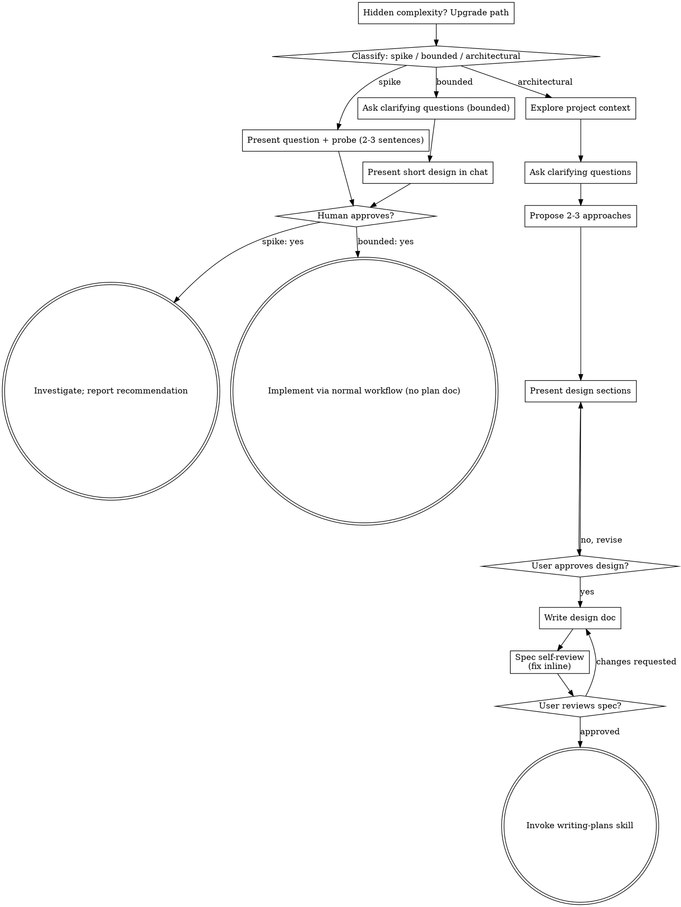

# Brainstorming Ideas Into Designs

**Ngôn ngữ:** Viết tài liệu spec bằng tiếng Việt — tiêu đề, diễn giải, business rule, edge case, tên test case.
**Ngôn ngữ:** Trao đổi với user bằng tiếng Việt. Giữ nguyên code, identifier, đường dẫn file, câu lệnh và tên type ở dạng gốc.

Help turn ideas into fully formed designs and specs through natural collaborative dialogue.

Start by classifying how much process the request needs, then work
through your path: understand the context, refine the idea, present a
design, and get your human partner's approval.

<HARD-GATE>
Do NOT invoke any implementation skill, write any code, scaffold any
project, or take any implementation action until you have told your
human partner what you intend and they have approved it. This applies
to EVERY task on EVERY path below — the ceremony scales with the task;
the approval gate never does.
</HARD-GATE>

## Three Paths

Before your first question, classify the request and say the
classification out loud — "this looks bounded, so I'll present a short
design here rather than write a spec" — so your human partner can
override it:

- **Spike** — a feasibility question ("can we...", "is it possible...",
  "quick and dirty is fine") whose output is an answer, not code you
  keep. Present the question and what you'll try in 2-3 sentences, get
  a nod, then find out as cheaply as correctness allows. No design
  doc, no spec file. Report findings as a recommendation; anything you
  built stays labeled throwaway.
- **Bounded** — a well-scoped change to code that already exists in
  this repo: a new flag, a small endpoint, a one-file fix.
  Understanding the kind of app is not enough — bounded means the flow
  you are changing is already here to read. If there is no existing
  flow to change, the task is not bounded. Ask the clarifying
  questions that matter, present a short design IN CHAT (a few
  sentences to a few short paragraphs), and STOP. Implementation
  starts only after your human partner says yes to that design — a
  bounded task's approval is as hard a gate as an architectural
  one. No spec file, no implementation plan document.
- **Architectural** — new projects, new subsystems, changes that
  restructure how components fit together or alter interfaces others
  depend on. Follow the full process: questions, approaches, sectioned
  design, written spec, then the writing-plans skill.

When in doubt between two paths, take the heavier one. The ratchet is
one-way: hidden complexity discovered mid-task upgrades the path —
stop, say so, and step up. Nothing downgrades mid-task.

## Anti-Pattern: "Too Simple To Need Approval"

Every path ends with your human partner approving your intent before
implementation. A todo list, a single-function utility, a config
change — the design may be two sentences in chat, but you MUST present
it and get approval. "Simple" tasks are where unexamined assumptions
cause the most wasted work. What scales with simplicity is the
artifact, never the approval.

## Red Flags

| Thought | Reality |
|---------|---------|
| "This is too simple to need a design" | Simple means a short design, not no design. Two sentences in chat, then approval. |
| "I'll call it bounded and skip the spec" | Reaching for a label to skip work IS the doubt — take the heavier path. |
| "It's bounded and the design is obvious — I'll start while they read it" | The gate is the approval, not the design's length. Present, then stop until you hear yes. |
| "I understand this kind of app, so it's bounded" | Bounded measures the repo, not your familiarity. A new project has no existing flow — it is architectural. |
| "The spike works, so I'll keep the code" | A spike's output is an answer. Keeping the code is a new request — classify it. |
| "It grew, but I'm almost done — no need to re-classify" | Hidden complexity upgrades the path mid-task. Stop and say so. |
| "They approved the spike, so the follow-up change is approved too" | Each task gets its own classification and its own approval. |

## Checklist

Classify first, announce the path, then create a task for each item on
your path and complete them in order.

**Spike:**
1. **Explore project context** — enough to frame the probe
2. **Present question + probe plan** — 2-3 sentences
3. **Get approval** — a nod is enough
4. **Investigate** — as cheaply as correctness allows
5. **Report findings** — a recommendation; label anything built as throwaway

**Bounded:**
1. **Explore project context** — check files, docs, recent commits
2. **Ask clarifying questions** — one at a time, the ones that matter
3. **Present short design in chat** — approach, files touched, testing
4. **Get approval** — STOP and wait for an explicit yes; presenting the design and starting in the same breath is skipping the gate
5. **Implement** — proceed with the normal development workflow (TDD applies); no plan document

**Architectural:**
1. **Explore project context** — check files, docs, recent commits
2. **Ask clarifying questions** — one at a time, understand purpose/constraints/success criteria
3. **Propose 2-3 approaches** — with trade-offs and your recommendation
4. **Present design** — in sections scaled to their complexity, get user approval after each section
5. **Write design doc** — save to `docs/superpowers/specs/YYYY-MM-DD-<topic>-design.md` and commit
6. **Spec self-review** — quick inline check for placeholders, contradictions, ambiguity, scope (see below)
7. **User reviews written spec** — ask user to review the spec file before proceeding
8. **Transition to implementation** — invoke writing-plans skill to create implementation plan

## Process Flow



**Terminal states are path-bound.** Architectural: the ONLY skill you
invoke after brainstorming is qskill-writing-plans — never any other
implementation skill. Bounded: after
approval, implementation proceeds directly through the normal
development workflow; no plan document. Spike: the terminal state is a
reported recommendation.

## The Process

The subsections below serve the bounded and architectural paths (a
spike stops at "present the probe, get a nod"). Sections from
**Exploring approaches** onward are architectural-path depth — for
bounded work, context plus a few questions plus a short in-chat design
is the whole process.

**Understanding the idea:**

- Check out the current project state first (files, docs, recent commits)
- Before asking detailed questions, assess scope: if the request describes multiple independent subsystems (e.g., "build a platform with chat, file storage, billing, and analytics"), flag this immediately. Don't spend questions refining details of a project that needs to be decomposed first.
- If the project is too large for a single spec, help the user decompose into sub-projects: what are the independent pieces, how do they relate, what order should they be built? Then brainstorm the first sub-project through the normal design flow. Each sub-project gets its own spec → plan → implementation cycle.
- For appropriately-scoped projects, ask questions one at a time to refine the idea
- Prefer multiple choice questions when possible, but open-ended is fine too
- Only one question per message - if a topic needs more exploration, break it into multiple questions
- Focus on understanding: purpose, constraints, success criteria

**Exploring approaches:**

- Propose 2-3 different approaches with trade-offs
- Present options conversationally with your recommendation and reasoning
- Lead with your recommended option and explain why
- YAGNI ruthlessly - remove unnecessary features from every approach and design

**Presenting the design:**

- Once you believe you understand what you're building, present the design
- Scale each section to its complexity: a few sentences if straightforward, up to 200-300 words if nuanced
- Ask after each section whether it looks right so far
- Cover: architecture, components, data flow, error handling, testing
- Be ready to go back and clarify if something doesn't make sense

**Design for isolation and clarity:**

- Break the system into smaller units that each have one clear purpose, communicate through well-defined interfaces, and can be understood and tested independently
- For each unit, you should be able to answer: what does it do, how do you use it, and what does it depend on?
- Can someone understand what a unit does without reading its internals? Can you change the internals without breaking consumers? If not, the boundaries need work.
- Smaller, well-bounded units are also easier for you to work with - you reason better about code you can hold in context at once, and your edits are more reliable when files are focused. When a file grows large, that's often a signal that it's doing too much.

**Working in existing codebases:**

- Explore the current structure before proposing changes. Follow existing patterns.
- Where existing code has problems that affect the work (e.g., a file that's grown too large, unclear boundaries, tangled responsibilities), include targeted improvements as part of the design - the way a good developer improves code they're working in.
- Don't propose unrelated refactoring. Stay focused on what serves the current goal.

## Spec Content Rules

A spec is a **Business Analyst document**, not a code sketch. It answers *what*
and *why*, never *how to write it*.

### 1. Depth: explain the logic, step by step

The value of a spec is in the reasoning an implementer cannot recover from the
codebase. Go as deep as you can here — this is the part worth spending on.

| Content | In the spec? |
|---|---|
| Goal, scope, explicit non-goals (YAGNI) | Required |
| Business rules and *why* each one exists | Required |
| User flows and the processing steps in execution order, numbered | Required |
| Edge cases, and the expected outcome for each one | Required |
| Error handling: which errors, which fields, what the user sees | Required |
| Architecture: the units, each unit's responsibility, boundaries, how they talk | Required |
| Data contracts / shapes (fields, types, meaning) — as a table or a short type | Required |
| Decisions made, the reasoning, and the alternatives rejected | Required |
| Function bodies, full components, implementation files | **Forbidden** |

Write the steps so a reader who has never seen the codebase can follow the
business logic end to end. "Validate the input" is not a step. "Reject when
`endDate` is earlier than `startDate`; return field-level error on `endDate`"
is a step.

### 2. Code: the one exception

A snippet of at most 10 lines, only when **both** hold:

1. It is special logic **just settled in this discussion** and confirmed by the
   user — a formula, rounding rule, regex, precedence order, value mapping.
2. Prose would be ambiguous, or longer than the snippet.

Add one line stating why it was settled that way; that reasoning is what the
plan and the implementer actually need.

Why the limit: code written at spec time is written blind. There is no codebase
open and no test run, so it gets rewritten during implementation anyway — you
pay the tokens twice and the first version is usually wrong. Only at
implementation time, with the real files and a passing test, is code trustworthy.

If you want to write code to *explore* a solution, the decision is not settled.
Ask the user, settle it in prose, then write the spec.

### 3. Removing code does NOT mean writing less

This is the single most common way to get this rule wrong. Dropping the code is
only half the instruction. The other half is mandatory:

> **Replace every deleted code block with the same logic re-expressed in
> Business Analyst language — the flow, in order, in words a non-programmer on
> the product side could follow and verify.**

You are changing the *language* the logic is written in, not the *amount* of
logic. A spec with code removed and nothing put back is a worse spec, and it
will be rejected.

BA language means: numbered steps in execution order, the condition for each
branch, what happens on each branch, what the caller/user ends up with, and what
happens when it goes wrong. Field names and values are welcome — they are domain
vocabulary, not code. Loops, syntax, and framework calls are not.

```
Code (forbidden here):
    for row in rows:
        if row.status == "draft" and row.owner_id != user.id:
            continue
        yield row

Vague (equally forbidden — this is the mistake):
    "Filter the rows appropriately based on the user"

BA language (required):
    1. Go through the rows in the order received.
    2. Skip a row when it is BOTH a draft AND owned by someone other than the
       current user — drafts are private to their owner until published.
    3. Keep every other row, including drafts owned by the current user.
    4. The original order is preserved; the input is never modified.
    5. If the row list is empty, the result is an empty list, not an error.
```

The BA version is *longer* than the code. That is expected and correct: it
carries the reasoning ("drafts are private until published") and the edge case
(empty list) that the code left implicit.

### 4. Testing: name the cases, do not write them

State the testing strategy and list the cases as plain text a human can read:

```
- rejects an end date earlier than the start date -> field error on endDate
- accepts an end date equal to the start date -> passes
- summary rows survive department filtering -> always kept
```

No test functions, no assertions, no framework syntax. A case is a sentence:
condition, then expected result.

---

## After the Design (architectural path)

**Documentation:**

- Write the validated design (spec) to `docs/superpowers/specs/YYYY-MM-DD-<topic>-design.md`
  - (User preferences for spec location override this default)
- Commit the design document to git

**Spec Self-Review:**
After writing the spec document, look at it with fresh eyes:

1. **Placeholder scan:** Any "TBD", "TODO", incomplete sections, or vague requirements? Fix them.
2. **Internal consistency:** Do any sections contradict each other? Does the architecture match the feature descriptions?
3. **Scope check:** Is this focused enough for a single implementation plan, or does it need decomposition?
4. **Ambiguity check:** Could any requirement be interpreted two different ways? If so, pick one and make it explicit.
5. **Code-bloat scan:** Every remaining code block must be either a data contract or special logic that was settled with the user, at most 10 lines. Otherwise delete it and replace it with a behavior description. Removing code must not make the spec vaguer — if a requirement becomes readable two ways once the code is gone, tighten the prose instead of putting the code back.

Fix any issues inline. No need to re-review — just fix and move on.

**User Review Gate:**
After the spec review loop passes, ask the user to review the written spec before proceeding:

> "Spec written and committed to `<path>`. Please review it and let me know if you want to make any changes before we start writing out the implementation plan."

Wait for the user's response. If they request changes, make them and re-run the spec review loop. Only proceed once the user approves.

**Implementation:**

- Invoke the writing-plans skill to create a detailed implementation plan
- Do NOT invoke any other skill. writing-plans is the next step.
