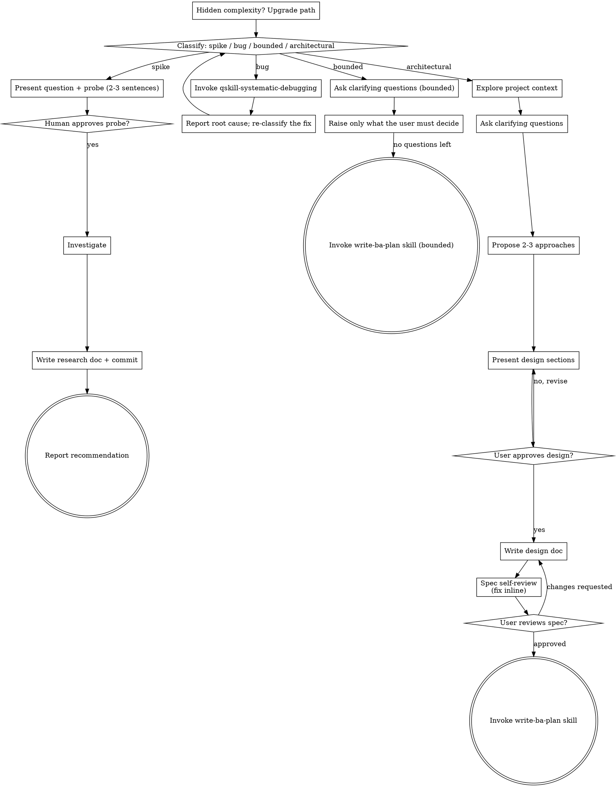

# Brainstorming Ideas Into Designs

**Language:** Write the documents this skill produces in Vietnamese — headings, prose, business rules, edge cases, test case names.
**Language:** Talk to the user in Vietnamese. Keep code, identifiers, file paths, commands and type names in their original form.

Help turn ideas into fully formed designs and specs through natural collaborative dialogue.

Start by classifying how much process the request needs, then work
through your path: understand the context, refine the idea, present a
design, and get your human partner's approval.

<HARD-GATE>
Do NOT invoke any implementation skill, write any code, scaffold any
project, or take any implementation action until you have told your
human partner what you intend and they have approved it. This applies
to EVERY task on EVERY path below — the ceremony scales with the task;
the approval gate never does.
</HARD-GATE>

## Four Paths

Before your first question, classify the request and say the
classification out loud — "this looks bounded, so I'll go straight to a
short plan instead of writing a spec" — so your human partner can
override it:

- **Spike** — a feasibility question ("can we...", "is it possible...",
  "quick and dirty is fine") whose output is an answer, not code you
  keep. Present the question and what you'll try in 2-3 sentences, get
  a nod, then find out as cheaply as correctness allows. No spec, no
  plan — but the answer is written down: record it as a research doc
  following [writing-research](references/writing-research.md), then
  report findings as a recommendation; anything you built stays labeled
  throwaway.
- **Bug** — wrong behavior: a runtime error, a wrong result, a failing
  test, a regression, something that used to work and no longer does.
  Do not brainstorm a design for a symptom. Stop this path and invoke
  the `qskill-systematic-debugging` skill to find the root cause first.
  With the root cause in hand, come back here, classify the fix
  (usually bounded; architectural if the structure has to change), and
  continue on that path.
- **Bounded** — a well-scoped change to code that already exists in
  this repo: a new flag, a small endpoint, a one-file fix.
  Understanding the kind of app is not enough — bounded means the flow
  you are changing is already here to read. If there is no existing
  flow to change, the task is not bounded. Ask the clarifying questions
  that matter; in chat raise ONLY what your human partner has to decide
  (open questions, choices, trade-offs) — do not restate the whole
  design there. Once no questions are left, do NOT write a spec: invoke
  the `qskill-write-ba-plan` skill to write a short plan, and let that
  skill handle the file, the commit and the review gate (see "Bounded
  Goes To write-ba-plan").
- **Architectural** — new projects, new subsystems, changes that
  restructure how components fit together or alter interfaces others
  depend on. Follow the full process: questions, approaches, sectioned
  design, written spec, then the write-ba-plan skill. Everything about
  approaches, design presentation and the spec document itself lives in
  [writing-specs](references/writing-specs.md) — read it before
  exploring approaches.

When in doubt between two paths, take the heavier one. The ratchet is
one-way: hidden complexity discovered mid-task upgrades the path —
stop, say so, and step up. Nothing downgrades mid-task.

## Commits Apply To Every Path

**Read this while you classify — the commit rules bind every path, not just
the architectural one.** Skipping the full spec does not skip the commit; a
bounded fix landing uncommitted is exactly the mess this rule exists to
prevent.

**Git gate, before any path starts:** run `git rev-parse --git-dir`. If this is
not a Git repository, STOP and ask the user to initialize Git. Do not probe, do
not implement, do not write a document. Without version control, several tasks
pile up in one working tree and the commits that eventually get made are dirty.

**Every commit carries a slug**, as the subject prefix `[<slug>]`. The slug is
always the path's own document filename minus its extension, date included —
`YYYY-MM-DD-<topic>` — so the whole work stream stays groupable from
`git log --oneline --grep`. Never strip the date. Which document, and the exact
commit format, belong to the path:

| Path | Document the slug comes from | Rules live in |
|---|---|---|
| **Spike** | the research doc | [writing-research](references/writing-research.md) |
| **Bounded** | the plan | `qskill-write-ba-plan` / `qskill-executing-plans` |
| **Architectural** | the spec, then the plan | [writing-specs](references/writing-specs.md) |
| **Bug** | none of its own — it ends at a root cause | the path the fix is re-classified into |

**Before reporting done on any path**, run `git status --porcelain`. Anything
still listed is unfinished work: commit it, or say explicitly what you left
uncommitted and why. Full rules:
[commit-convention](../qskill-executing-plans/references/commit-convention.md).

## Bounded Goes To write-ba-plan

Bounded writes no spec, but it still leaves a document behind — and that
document is a **plan**, not a file format of its own.

Why: a bounded task can still stretch across several sessions. In a
later session your human partner runs `qskill-executing-plans` to carry
on, and that skill reads only plan documents under
`docs/superpowers/plans/`. A design parked in a spec or a bespoke brief
file leaves nothing to execute — so bounded and architectural funnel
into the same single document type.

**When no questions are left:** say briefly that you are moving on to
write the plan, then invoke the `qskill-write-ba-plan` skill. From that
point everything — plan content, file path, slug, commits, the user
review gate, the handoff to `qskill-executing-plans` — follows that
skill's rules. Do not restate or reinvent those rules here.

**The one difference from architectural:** a bounded task has no spec
document, so in the plan header the `Spec:` field reads `none (bounded
task)` followed by a sentence or two summarizing the request and why
this approach was chosen — that is the record someone reads later to
learn why the change was made this way.

**The approval gate is unchanged:** you do not write code in the turn
where you hand over. The plan gets written, committed, reviewed by your
human partner, and only then implemented.

## Anti-Pattern: "Too Simple To Need Approval"

Every path ends with your human partner approving your intent before
implementation. A todo list, a single-function utility, a config
change — the plan may be a few lines, but you MUST put it in front of
your human partner and get approval. "Simple" tasks are where unexamined assumptions
cause the most wasted work. What scales with simplicity is the
artifact, never the approval.

## Red Flags

| Thought | Reality |
|---------|---------|
| "This is too simple to need a design" | Simple means a short design, not no design. Write the short plan, then wait for approval. |
| "I'll call it bounded and skip the spec" | Reaching for a label to skip work IS the doubt — take the heavier path. |
| "Bounded means nothing gets written down" | Bounded still produces a plan via qskill-write-ba-plan. A later session needs something to execute. |
| "The short design is in the chat, no need for a plan" | Chat is not searchable three months later, and executing-plans cannot read chat. |
| "I'll restate the whole design in chat to be safe" | Chat is only for what your partner must decide. The design lives in the plan. |
| "It's a small bounded task, I'll just write my own design file" | One document type: the plan. A bespoke file is a file no skill can run. |
| "It's only a small bug, I can guess where it broke" | Bugs go through qskill-systematic-debugging first. A guess is not a root cause. |
| "It's bounded and the design is obvious — I'll start while they read it" | The gate is the approval, not the design's length. Present, then stop until you hear yes. |
| "I understand this kind of app, so it's bounded" | Bounded measures the repo, not your familiarity. A new project has no existing flow — it is architectural. |
| "The spike works, so I'll keep the code" | A spike's output is an answer. Keeping the code is a new request — classify it. |
| "It grew, but I'm almost done — no need to re-classify" | Hidden complexity upgrades the path mid-task. Stop and say so. |
| "They approved the spike, so the follow-up change is approved too" | Each task gets its own classification and its own approval. |
| "No spec, so there is no slug to commit with" | Spike uses the slug from its research filename; bounded uses the slug from the plan filename. No spec never means no document and never means no commit. |
| "The spike answer is in the chat, that's enough" | Chat is not searchable three months later. A spike ends at a committed research doc under `docs/superpowers/research/`. |
| "I'll write the spec from memory, I know the rules" | Spec rules live in references/writing-specs.md. Read the file before writing the spec. |
| "It's a bounded one-file fix — the user can commit it" | The path that writes the file commits the file. Leaving it dirty is what makes later history unreadable. |
| "The spike code is throwaway, so I'll just leave it lying around" | Throwaway means deleted. Anything still on disk gets committed. |

## Checklist

Classify first, announce the path, then create a task for each item on
your path and complete them in order.

**Spike:**
1. **Explore project context** — enough to frame the probe
2. **Present question + probe plan** — 2-3 sentences
3. **Get approval** — a nod on the probe is enough
4. **Investigate** — as cheaply as correctness allows
5. **Write the research doc** — per [writing-research](references/writing-research.md): write it, self-review, commit it
6. **Commit or delete what you built** — throwaway probes get deleted; anything kept is committed under the research slug, then `git status --porcelain` must be clean
7. **Report findings** — a recommendation; label anything built as throwaway

**Bug:**
1. **Invoke `qskill-systematic-debugging`** — before anything else; no guessing, no patching the symptom
2. **Report root cause** — state the real cause and the evidence for it
3. **Re-classify the fix** — bounded or architectural, then run that path's checklist in full (approval gate and plan document included)

**Bounded:**
1. **Explore project context** — check files, docs, recent commits
2. **Ask clarifying questions** — one at a time, the ones that matter
3. **Raise in chat only what your partner must decide** — open questions, choices between approaches, trade-offs; do not restate the whole design
4. **Invoke qskill-write-ba-plan** — once no questions are left; a short plan, with `Spec:` reading `none (bounded task)` plus a summary of the request and why this approach was chosen
5. **Follow that skill's rules from there** — it owns the plan file, slug, commits, the user review gate, and the handoff to qskill-executing-plans

**Architectural:**
1. **Explore project context** — check files, docs, recent commits
2. **Ask clarifying questions** — one at a time, understand purpose/constraints/success criteria
3. **Read [writing-specs](references/writing-specs.md)** — it owns approaches, design presentation, spec content and the spec document
4. **Propose 2-3 approaches** — with trade-offs and your recommendation
5. **Present design** — in sections scaled to their complexity, get user approval after each section
6. **Write design doc** — per [writing-specs](references/writing-specs.md): write it, then commit it
7. **Spec self-review** — per the same reference; fix inline
8. **User reviews written spec** — ask user to review the spec file before proceeding
9. **Transition to implementation** — invoke write-ba-plan skill to create implementation plan

## Process Flow

**Terminal states are path-bound.** Architectural: the ONLY skill you
invoke after brainstorming is qskill-write-ba-plan — never any other
implementation skill. Bounded: also ends at qskill-write-ba-plan — the
only difference is that no spec document precedes it. Spike: the terminal
state is a committed research doc plus a reported recommendation. Bug: the terminal state is a root
cause plus a re-classification — the fix runs on its own path.

## The Process

The subsections below are shared by every path that designs something —
bounded and architectural alike. A spike stops at "present the probe, get
a nod" and then records the answer per
[writing-research](references/writing-research.md).

The architectural-only depth — exploring approaches, presenting the design
in sections, and every rule about the spec document — lives in
[writing-specs](references/writing-specs.md). For bounded work, context
plus a few questions plus a short in-chat design is the whole process.

**Understanding the idea:**

- Check out the current project state first (files, docs, recent commits)
- Before asking detailed questions, assess scope: if the request describes multiple independent subsystems (e.g., "build a platform with chat, file storage, billing, and analytics"), flag this immediately. Don't spend questions refining details of a project that needs to be decomposed first.
- If the project is too large for a single spec, help the user decompose into sub-projects: what are the independent pieces, how do they relate, what order should they be built? Then brainstorm the first sub-project through the normal design flow. Each sub-project gets its own spec → plan → implementation cycle.
- For appropriately-scoped projects, ask questions one at a time to refine the idea
- Prefer multiple choice questions when possible, but open-ended is fine too
- Only one question per message - if a topic needs more exploration, break it into multiple questions
- Focus on understanding: purpose, constraints, success criteria

**Design for isolation and clarity:**

- Break the system into smaller units that each have one clear purpose, communicate through well-defined interfaces, and can be understood and tested independently
- For each unit, you should be able to answer: what does it do, how do you use it, and what does it depend on?
- Can someone understand what a unit does without reading its internals? Can you change the internals without breaking consumers? If not, the boundaries need work.
- Smaller, well-bounded units are also easier for you to work with - you reason better about code you can hold in context at once, and your edits are more reliable when files are focused. When a file grows large, that's often a signal that it's doing too much.

**Working in existing codebases:**

- Explore the current structure before proposing changes. Follow existing patterns.
- Where existing code has problems that affect the work (e.g., a file that's grown too large, unclear boundaries, tangled responsibilities), include targeted improvements as part of the design - the way a good developer improves code they're working in.
- Don't propose unrelated refactoring. Stay focused on what serves the current goal.

## Path References

The rest of the process is path-specific. Read only the file for the path
you classified into:

- **Spike** — [writing-research](references/writing-research.md): where the
  research doc goes, its header, content rules, self-review and commit.
- **Architectural** — [writing-specs](references/writing-specs.md):
  exploring approaches, presenting the design, spec content rules, the spec
  document, its commit, self-review and the user review gate.
- **Bounded** — no reference file here; invoke `qskill-write-ba-plan` and
  follow that skill.
- **Bug** — no reference file here; invoke `qskill-systematic-debugging`,
  then re-classify.
